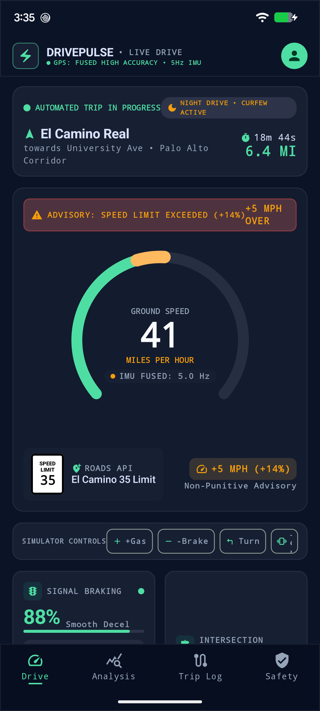
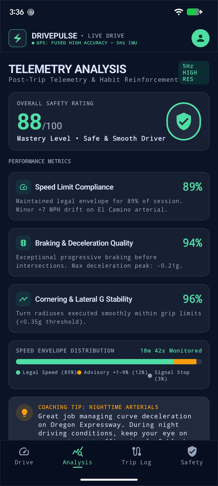
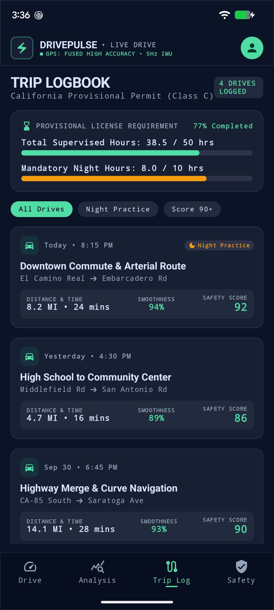
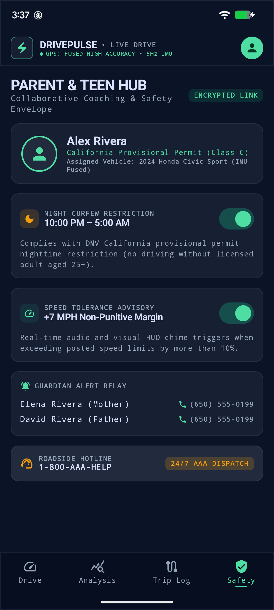

# First Gear: Teen Driver Safety Tracker 🏎️⚡

[](https://kotlinlang.org)
[](https://developer.android.com/studio/releases/gradle-plugin)
[](https://developer.android.com/jetpack/compose)
[-orange.svg)](https://kotlinlang.org/docs/multiplatform.html)
[](https://developer.android.com)

> **First Gear** bridges high-precision endurance racing instrumentation with modern, non-punitive safety coaching for novice drivers and their families. Built with **Kotlin Multiplatform (KMP)** and **Jetpack Compose**, based on the *Apex Telemetry & DrivePulse* design system.

---

## 📱 Visual Showcase (Live on Google Pixel 7a)

| 1. Live Drive HUD | 2. Telemetry Analysis | 3. Trip Logbook | 4. Safety Hub |
| :---: | :---: | :---: | :---: |
|  |  |  |  |
| *Real-time 5Hz IMU & Speedometer* | *Post-drive habits & score matrix* | *DMV 50hr & night practice tracker* | *Curfew & non-punitive envelope* |

---

## ✨ Key Features

### 🎛️ 1. Cockpit Telemetry HUD (`Live Drive`)
* **Radial Speedometer Visualizer**: Custom Canvas-rendered concentric arcs with legal speed limit boundary (Electric Emerald) and dynamic exceedance segments (Caution Amber).
* **Tabular Numeral Readout**: Strict monospace OpenType tabular typography (`JetBrains Mono`) prevents horizontal jitter during rapid speed fluctuations.
* **Authentic MUTCD Speed Limit 35 Shield**: Styled US standard speed sign with Roads API source and non-punitive delta pill (`+5 MPH (+14%)`).
* **2x2 Sensor Pods**:
  * **Signal Braking**: 88% Smooth Decel with animated progress gauge and last stop G-force rating (`0.18g`).
  * **Intersection Rating**: 0.94 Optimal safe approach indicator and throttle release verification.
  * **IMU G-Force Traction Circle**: 2D friction circle with concentric grip thresholds, crosshairs, and live G-force locator dot.
  * **Jerk & Shock IMU**: Pitch & damping transition rates benchmarked against comfort standards (`<0.4g/s`).
* **Interactive Physics Simulator**: Test live telemetry responses with `+Gas`, `-Brake`, `Turn` (lateral G spike), and `Jerk` (pavement shock) buttons.
* **Waypoint Horizon**: Path timeline tracking passed (*Charleston Rd*), current (*Oregon Expy*), and upcoming (*University Ave*) intersections with live ETA.
* **Action Strip**: Emergency SOS roadside relay dialog and End Trip confirmation modal.

### 📊 2. Post-Trip Telemetry Analysis (`Analysis`)
* **Overall Safety Rating Card**: Overall score (e.g. `88/100`), classification badges, and mastery tier.
* **Telemetry Breakdown**: Granular scores for Speed Limit Compliance (89%), Braking & Deceleration Quality (94%), and Lateral G Stability (96%).
* **Speed Distribution Bar**: Visual segmented distribution bar comparing legal speed, advisory margins, and signal stops.
* **Nighttime Coaching Insights**: Context-aware recommendations for night driving on arterial corridors.

### 📋 3. Automated DMV Logbook (`Trip Log`)
* **California Provisional Permit Progress**: Dual progress bars tracking DMV practice requirements:
  * Total Supervised Hours: `38.5 / 50 hrs` (77% complete)
  * Mandatory Night Hours: `8.0 / 10 hrs` (80% complete)
* **Historical Drive Records**: Filter drives by *All Drives*, *Night Practice*, and *Score 90+*, logging distance, elapsed minutes, smoothness percentage, and safety ratings.

### 🛡️ 4. Collaborative Coaching (`Safety Hub`)
* **Teen Driver Profile**: Driver credentials for *Alex Rivera* (Permit Class C) and connected vehicle (*2024 Honda Civic Sport*).
* **Curfew Enforcement**: Night driving restrictions (10:00 PM – 5:00 AM) aligned with DMV provisional permit laws.
* **Non-Punitive Speed Envelope**: Configurable `+7 MPH` tolerance margin before guardian notifications trigger.
* **Emergency Dispatch**: Instant 24/7 AAA roadside assistance dispatch and parent guardian phone relays.

---

## 🎨 Design System

The app implements the design system documented in [`DESIGN.md`](DESIGN.md):

* **Substrate / Background**: Deep Obsidian (`#0B1326` / `#0F172A`) for zero glare during night drives and OLED power efficiency.
* **Elevated Cards**: Slate Graphite (`#171F33` / `#1E293B`) with hairline borders (`rgba(148, 163, 184, 0.12)`).
* **Electric Emerald** (`#10B981` / `#4EDEA3`): Optimal speed, steady steering, and high safety scores.
* **Caution Amber** (`#F59E0B` / `#FFB95F`): Speed limit drift and threshold advisory alerts.
* **Vivid Coral-Red** (`#EF4444` / `#FFB3AD`): Critical deceleration spikes and harsh braking.
* **Typography**:
  * Instrumentation & Numbers: `JetBrains Mono`
  * Headings & Display: `Space Grotesk`
  * Narrative Body: `Geist`

---

## 🏛️ Project Architecture (Kotlin Multiplatform)

```
First Gear/
├── settings.gradle.kts           # Multiplatform Gradle project definition
├── build.gradle.kts              # Root build script
├── local.properties              # Local Android SDK path (git-ignored)
├── shared/                       # 🌐 KMP Multiplatform Logic (Android & iOS)
│   ├── build.gradle.kts
│   └── src/commonMain/kotlin/com/firstgear/
│       ├── model/
│       │   ├── TelemetryData.kt  # 5Hz IMU, fused GPS, and snapshot models
│       │   ├── TripRecord.kt     # Logbook drives & safety scoring models
│       │   └── SafetyHubData.kt  # Curfew rules & provisional permit profile
│       ├── engine/
│       │   └── TelemetrySimulator.kt # Coroutine physics engine (G-forces, jitter, timer)
│       └── repository/
│           └── TripLogRepository.kt  # StateFlow-driven reactive repository
└── androidApp/                   # 📱 Native Android App (Jetpack Compose)
    ├── build.gradle.kts          # Jetpack Compose BOM, Material3
    └── src/main/
        ├── AndroidManifest.xml
        └── java/com/firstgear/telemetry/
            ├── MainActivity.kt
            └── ui/
                ├── MainApp.kt    # Root scaffold, state coordinator & bottom nav
                ├── theme/        # Theme tokens, Color.kt, Type.kt, Theme.kt
                ├── components/   # SpeedometerGauge, FrictionCircle, SpeedLimitShield
                └── screens/      # LiveDriveScreen, AnalysisScreen, TripLogScreen, SafetyHubScreen
```

---

## 🛠️ Building & Running Locally

### Prerequisites
* **Java**: OpenJDK 17 or higher
* **Android SDK**: API Level 35 with build-tools `35.0.0`
* **Gradle**: 8.11.1 (managed via Gradle Wrapper `./gradlew`)

### Setup Instructions

1. **Clone the repository**:
   ```bash
   git clone https://github.com/lrndroid/FirstGear-Android.git
   cd FirstGear-Android
   ```

2. **Configure your Android SDK path**:
   Create a `local.properties` file in the root directory:
   ```properties
   sdk.dir=/path/to/your/Android/sdk
   ```
   *(On macOS: `~/Library/Android/sdk`)*

3. **Assemble the debug APK**:
   ```bash
   ./gradlew assembleDebug
   ```

4. **Install and run on a connected device / emulator**:
   ```bash
   ./gradlew installDebug
   adb shell am start -n com.firstgear.telemetry/.MainActivity
   ```

---

## 📄 License
This project is open-source under the [Apache License 2.0](LICENSE).
